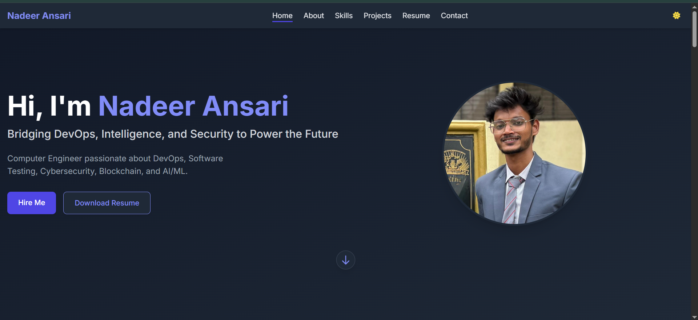
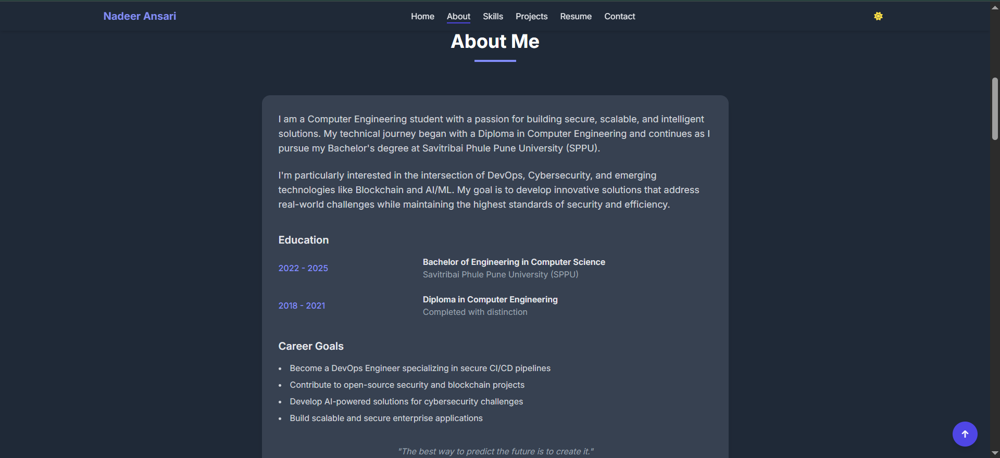
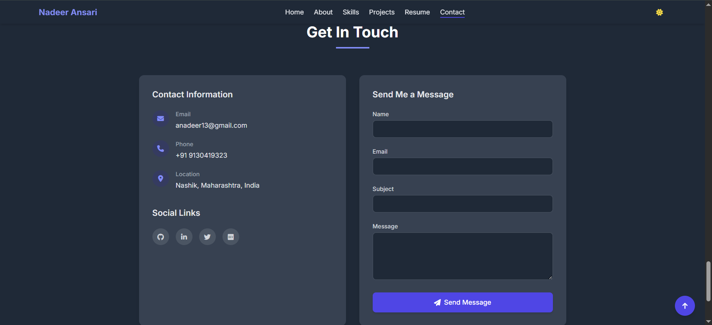
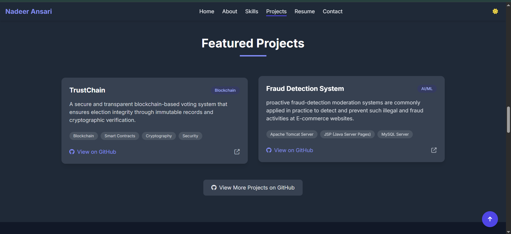
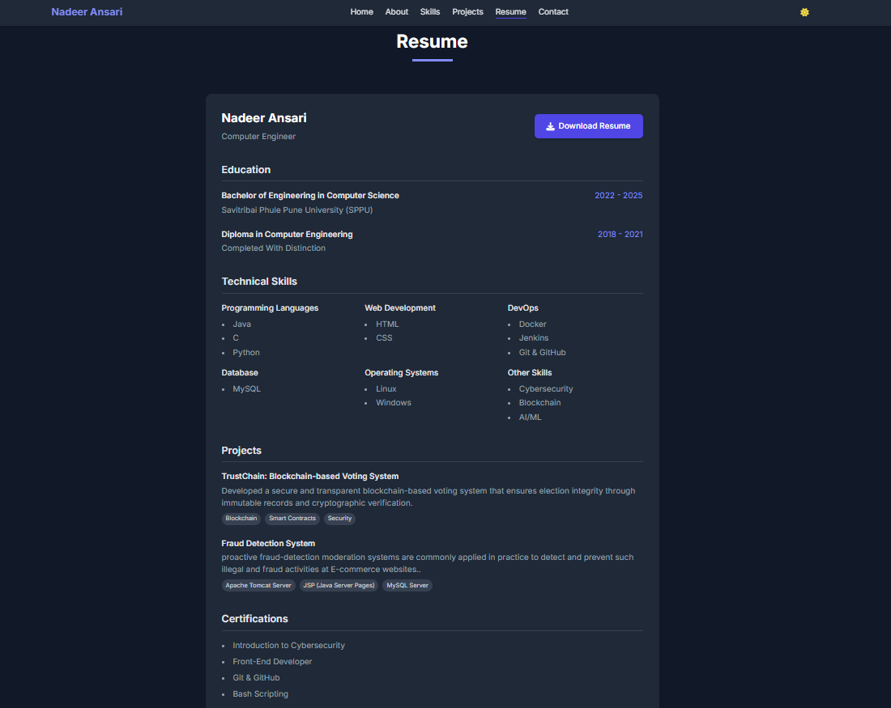
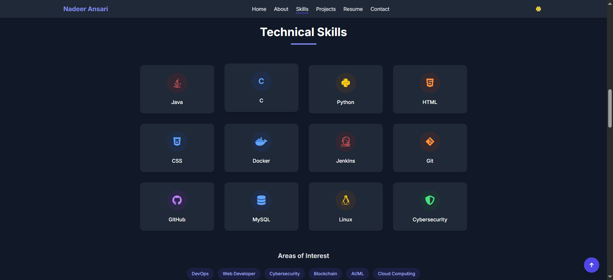

# Nadeer Ansari - Portfolio Website

This is my personal portfolio website showcasing my background, skills, projects, and social presence. Built entirely with HTML and CSS, styled to match my Canva design.

## 🧑‍💼 About Me
- Name: Nadeer Ansari
- Degree: B.E. Computer Engineering (Pune University)
- Focus: DevOps, Software QA, HPC, and Deep Learning

## 📁 Sections:
- Home
- About
- Projects
- Resume
- Contact (LinkedIn, Twitter)

## 🌐 Hosted on:
Canva + [Coming Soon: GitHub Pages or Netlify]

## 🛠️ Tech Stack:
- HTML5
- CSS3
- Custom Styling based on Canva layout

## 📸 Portfolio Website Screenshots

### 🏠 Home Section

### 👤 About Section

### 📞 Contact Section

### 📁 Projects Section

### 📃 Resume Section

### 💼 Skills Section

## 🔗 Social Links:
- [LinkedIn](https://www.linkedin.com/in/nadeer-ansari)
- [Twitter](https://twitter.com/Nadeer_Ansari)

## 📜 License:
MIT
