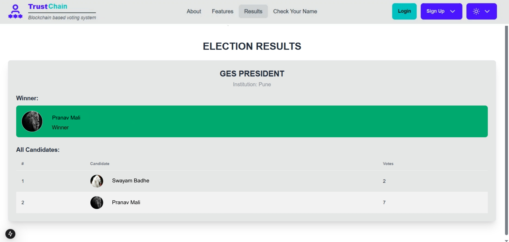
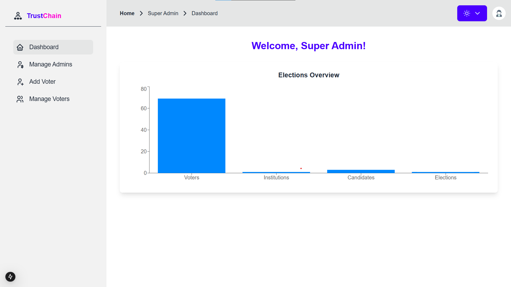
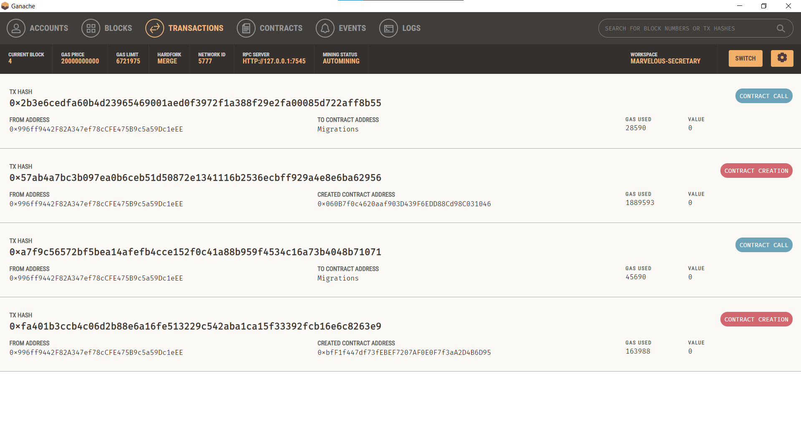

# Trustchain: Blockchain-Based Decentralized Voting System

This project is a secure and transparent voting system built on blockchain technology. It ensures data integrity, voter anonymity, and decentralization to eliminate fraud and manipulation.

## 🔐 Key Features:
- Blockchain ledger for vote recording
- SHA-256 hashing for data security
- Role-based voter authentication
- Transparent and immutable vote tallying

## 🛠️ Tech Stack:
- Language: Java
- Blockchain Logic: Custom Implementation
- Data Structure: Merkle Tree
- Environment: Local Java Runtime

## 📁 Project Structure:
- `Block.java` - Handles block data and hashing
- `Blockchain.java` - Manages the chain and validation
- `Vote.java` - Voter input and simulation
- `Main.java` - Runs the full system

## 📸 Project Screenshots

### 🔐 Admin Login

### 🗳️ Cast Vote

### 🗃️ Database

### 🧮 Election Result

### 🗓️ Events-Ganach

### 🛠️ Start Election

### 🔓 Super Admin Login

### 📊 Super Admin Dashboard

### 📋 Transaction Details

### ✅ Verify Candidates

## 📜 License:
MIT
